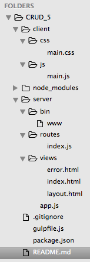

# CRUD ASSESMENT 5

# Full Stack CRUD Assessment - todo

Week of 10/19/2015.

## Server-Side Only

> Time yourself. Shoot for under an hour!

1. Create the project structure.
1. Utilize the resource of your choice - i.e., vehicles, superheroes, planets, coding schools, cookies, eclipses...
1. Create the RESTful route structure.
1. Setup MongoDB, Mongoose, and define your schema.
1. Update each route to connect to the database and return JSON. Test with cURL, HTTPie, or Postman.

# TO DO:

1. **Set up Project Structure**

  - In terminal =

  ```
  $ yo galvanize-express
  $ npm install
  $ npm install mongoose --save
  $ npm install dotenv -- save
  $ brew install httpie
  ```

  - Now check your package.json file. It should update the dependences to include mongoose and dotenv. It should look similar to this:

  ```
  {
    "name": "_example",
    "version": "0.0.0",
    "private": true,
    "scripts": {
      "start": "node ./server/bin/www"
    },
    "dependencies": {
      "body-parser": "~1.13.2",
      "cookie-parser": "~1.3.5",
      "debug": "~2.2.0",
      "dotenv": "^1.2.0",
      "express": "~4.13.1",
      "mongoose": "^4.2.3",
      "morgan": "~1.6.1",
      "serve-favicon": "~2.3.0",
      "swig": "^1.4.2"
    },
    "devDependencies": {
      "browser-sync": "2.9.6",
      "gulp": "^3.9.0",
      "gulp-jshint": "^1.11.2",
      "gulp-nodemon": "^2.0.4",
      "jshint-stylish": "^2.0.1"
    }
  }
  ```

  - Your project structure should look something like this:

  

  - **Commit!**

1. **Finish updating structure:**

  - Now find ``app.js`` under ``server`` directory. Place on top another requirement:

  ```
  var dotenv = require('dotenv');
  dotenv.load();
  ```

  - Now place ``.env`` at the bottom of ``.gitignore`` file. We are setting up the environment variables and hiding them within the .gitignore file.

  - Now add .env file to root directory through the terminal

  ```
  $ touch .env
  ```

  - **Commit!**

3. **Create Model folder add Schema and connect Mongoose to .env and model**
  - Create the ``model`` folder under the ``server`` directory
  - Create a JavaScript file in the ``model`` folder to represent what you would like to store... let's call it ``url.js``
  - Create Schema for ``url.js``, add requirements on top, connect to mongoose on bottom, then export the module.
  - Should look similar to this (minus the comments):

  ```
  // bring in mongoose and grab the Schema constructor
  var mongoose = require('mongoose');
  var Schema = mongoose.Schema;


  // create new Schema, setting keys and value types
  var Url = new Schema({
      link: String,
      title: String,
      description: String
  });

  //* OPTIONAL *//
  // set up the connection to the local database, if it doesn't exist yet one will be created automatically
  //>> mongoose.connect('mongodb://localhost/mongo-url');

  //if you would like this information private then pull this info from the .env file - check .env set up.
  mongoose.connect(process.env.MONGO_URI);

  // make the Item Schema available to other files
  module.exports = mongoose.model("urls", Url)
  ```

  - In the ``.env`` file place on top:

  ```
  MONGO_URI=mongodb://localhost/urls
  ```

3. **Set up Route Structure**

  - create ``api.js`` within route directory

  - Let's tell ``app.js`` that we need to connect to these routes. Add to the routes sections of ``api.js`` -- *(if all routes are in index then we don't need to add the following)* -- :

  ```
  //** routes **//
  var routes = require('./routes/index.js');
  var urls = require('./routes/urls.js')

  // ** main routes ** //
  app.use('/', routes);
  app.use('/api/', urls)
  ```

  - Add requirements on **top** of ``api.js.`` These requirements is express, express's router, and the model of the schema. Index.js has a similar set up...

  ```
  var express = require('express');
  var router = express.Router();
  var url = require('../model/urls.js')

  ```

  - Now lets set up basic structure of our routes:

  ```
  //get all urls
  router.get('/urls', function(req, res, next) {
    res.send("hello");
  });

  //get one urls
  router.get('/url/:id', function(req, res, next) {
  });

  //post urls
  router.post('/urls', function(req, res, next) {
  });

  //update one url
  router.put('/url/:id', function(req, res, next) {
  });

  //delete one url
  router.delete('/url/:id', function(req, res, next) {
  });

  module.exports = router;
  ```

  - **TEST** GET router by opening three terminal windows.
    1. ``sudo mongod``
    2. ``nodemon``
    3. ``http GET http://localhost:3000/api/urls``
  - In the third widow you should get back the "hello"

  - **COMMIT!**


4. **Finish Route Structure and continue TESTING**

  - We will be adding Mongoose functions to our database:
      - url.find()
      - url.findById()
      - newUrl.save()
      - url.findByIdAndUpdate()
      - url.findByIdAndRemove()

  - Set up **POST router** now:
  - Add new instance of the Schema within the post router and a 'save it' function

  ```
  //post urls
  router.post('/urls', function(req, res, next) {
    var newurl = new url(req.body);
    newUrl.save(function(err, url) {
      if (err) {
        res.json({'message': err});
      } else {
        res.json(data) //data can be named anything
      }
    })
  });
  ```

  - **TEST!** POST router in terminal:
  ```
    http POST http://localhost:3000/api/urls url="google.com" title="google" description="google search engine"``
    or
    http POST -f http://localhost:3000/api/urls ...``
    or
    http POST --form http://localhost:3000/api/urls ...``
  ```

  - Now update **GET ALL router** - with mongoose **find()** function

    ```
    router.get('/urls', function(req, res, next) {
        url.find(function(err, urls) {
            if (err) {
                res.json({'message': err});
            } else {
                res.json(urls); //data can be named anything
            }
        })
    });
    ```

  **TEST!** GET all router in terminal:
  ```
  http GET http://localhost:3000/api/urls
  ```

  - Helpful resource : [mongoosejs.com/docs/api.html](mongoosejs.com/docs/api.html)

  - Set up **GET one router** - with mongoose **findById()** function

  ```
    //get one url
    router.get('/url/:id', function(req, res, next) {
      url.findById(req.params.id, function(err, url) {
        if (err) {
          res.json({'message': err});
        } else {
          res.json(url);
        }
      })
    });
  ```

  **TEST!** GET one router in terminal:
  ```
  http GET http://localhost:3000/api/url/<id#>
  ```

  - Set up **PUT router** - with mongoose **findByIdAndUpdate()** function

  ```
  //update one url
  router.put('/url/:id', function(req, res, next) {
    //adding {new:true} in the third passed agrument this will output the updates in the terminal instead of the original
    var options = {new: true};
    url.findByIdAndUpdate(req.params.id, req.body, options, function(err, url) {
      if (err) {
        res.json({'message': err});
      } else {
        res.json(url);
      }
    })
  });
  ```

  **TEST!** PUT router in terminal:

  ```
  http PUT http://localhost:3000/api/url/<id#> changes=change
  ```

  - Set up **DELETE router** - with mongoose **findByIdAndRemove()** function

  ```
    //delete one url
    router.delete('/url/:id', function(req, res, next) {
      url.findByIdAndRemove(req.params.id, function(err, url) {
         if (err) {
            res.json({'message': err});
          } else {
            res.json(url)
          }
      })
    });
  ```

  **TEST!** DELETE router in terminal:

  ```
  http DELETE http://localhost:3000/api/url/<id#>
  ```

  ## Set up View
  - Create Form, Table, whatever in ``index.html`` (or create a new html file) under ``views`` directory on the server side
  - Set up **ids** to each area of the form so that it points to each property of the **schema**
  - We are going to use **JSON** to auto populate all urls below the form and so we attach the ``id="all-urls"`` to a seperate div, table, whatever below the input form
  - Under client side in the ``main.js`` file add a ``payload`` to the "submit" form function. Then run tests throughout...

  ```
    $('form').on('submit', function(e){
        e.preventDefault();
        var payload = {
            link: $('#link').val(),
            title: $('#title').val(),
            description: $('#description').val()
        };

        console.log(payload) //test here or httpie

        $.post('/api/urls', payload, function(data){
            $('.message-section').show(); //bootstrap alert alert-success, and on client side, set css display: none
            console.log(data); //test here or httpie < should have Id now
            $('#message').html('url has been added!');

            //populate the table from function below
            geturls();
        });
    })
  ```

    + Define a function outside of submit so that it will append the urls
        + don't forget to call function in **document.ready** to pre-load the data

  ```
    function geturls(){
        //target table and clear out fields
        $('#all-urls').html('');

        //inside ajax and iterate over all the data (all the urls)
        $.get('/api/urls', function(data) {
            //test = console.log(data)-- don't forget to call function
            for (var i=0; i < data.length; i++) {
                $('#all-urls').append(
                      '<tr><td>' + data[i].link + '</td><td>' + data[i].title + '</td><td>' + data[i].description + '</td></tr>'
                );
            }
            //clear out form and checkbox area
            $('form input').val('');
        });
    }
  ```

  # THE END!

  **Quick Reference for testing routes in terminal**
  - remember that if the value of the key is a boolean, number or other element besides a string then it does not need to be wrapped in quotes.

  ```
    http GET http://localhost:3000/api/urls
    http GET http://localhost:3000/api/url/<id#>
    http POST http://localhost:3000/api/urls link="google.com" title="google" description="google search engine"
    http PUT http://localhost:3000/api/url/<id#> changes="change"
    http DELETE http://localhost:3000/api/url/<id#>
  ```
